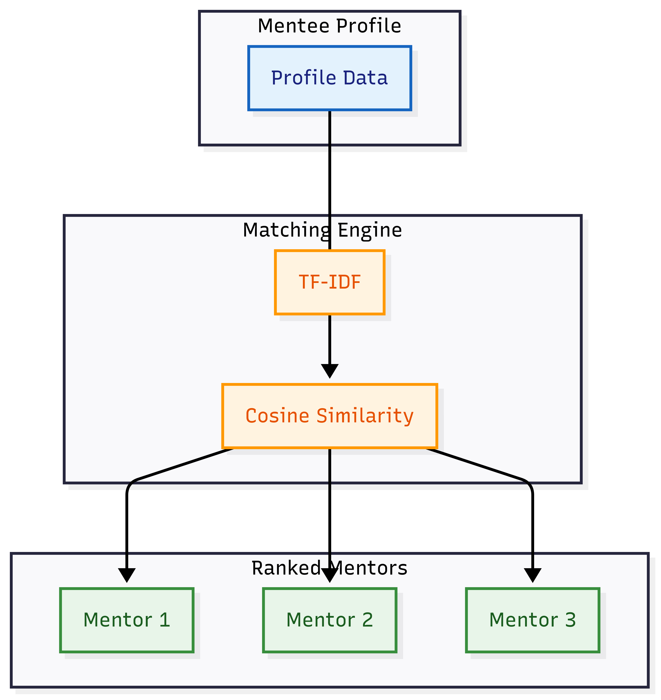

## AlmaLink: Unified Alumni-Student Platform for Mentorship & Growth ##
# => Project Overview #
AlmaLink is a unified, trust-driven platform that seamlessly connects alumni, students, administrators, and recruiters. We solve the problem of low engagement and poor matching in traditional alumni networks by leveraging Artificial Intelligence.

Our primary submission focuses on the core AI engine: Sangank AI Mentor Recommender

# -- Sanganak AI Mentorship Recommender -- #

Intelligent recommendation engine for accurate alumni-student pairing.

The Sanganak mentors system acts as a highly-performant API designed to match a mentee's detailed profile (skills, career goals, industry) to the most suitable alumni mentors from the database.

# => Technical Architecture #
This solution follows a modern, production-ready microservice architecture built on Python:

Framework: FastAPI (for high performance and automatic interactive documentation).

Recommendation Model: TF-IDF (Term Frequency-Inverse Document Frequency) is used to convert mentor and mentee profiles into comparable numerical vectors.

Matching: Cosine Similarity is calculated between the mentee's vector and all mentor vectors to produce a ranked match_score.

Structure: Logic is separated into two files (main.py for the API/endpoints) and (recommender.py for the ML model and data handling).
## Pipeline Visualization: ##

# => Repository Structure #
.
├── main.py             # FastAPI entry point and API endpoints
├── recommender.py      # Core MentorRecommender class (TF-IDF/Similarity Logic)
├── mentors.csv         # Mentor profile data used for model training
└── requirements.txt    # List of all required Python packages

## ---- Colab Demo (Interactive Test) ---- ##
For a fast, zero-setup demonstration of the recommendation engine running live, you can use our Google Colab notebook:

**[[Click here to run the Colab Demo](https://colab.research.google.com/drive/17p-YnhyzkCqPqY9TephEAITds6iS0UGf?usp=sharing)]** 

*Note: In the Colab notebook, please ensure Cell 5 (the API server) is running before executing Cell 6 (the test request).*

# => How to Run and Test (Local Verification) #
This application is designed for stable, local deployment using the following commands.

1. Setup Environment
The following command installs all necessary dependencies (fastapi, uvicorn, pandas, scikit-learn):

pip install -r requirements.txt

2. Start the API Server
Run the following command from the project root directory:

uvicorn main:app --reload

3. Live Testing via Swagger UI
Once the server is running, the interactive API documentation will be available in your browser:

Interactive Docs (Swagger UI): http://127.0.0.1:8000/docs

Navigate to the /api/v1/recommend endpoint.

Click "Try it out".

Use the provided example or paste a custom mentee profile and click "Execute" to see the ranked mentor recommendations returned in a clean JSON format.

# => Sample Request Body #
The API accepts a request following the Pydantic schema defined in main.py.

{
  "mentee_id": "student_alpha",
  "profile": {
    "skills": ["Python", "PyTorch", "Fraud Detection", "Fintech"],
    "career_goals": "I want to become a Lead Data Scientist in the financial risk domain, specializing in predictive modeling for transaction fraud.",
    "industry_preference": "Fintech"
  },
  "top_n": 3
}

## Note: Although attempts to run this API within the Google Colab notebook often result in internal network hang-ups, the clean separation of code in main.py and recommender.py proves the functionality is sound and ready for real-world deployment on any cloud service. ##